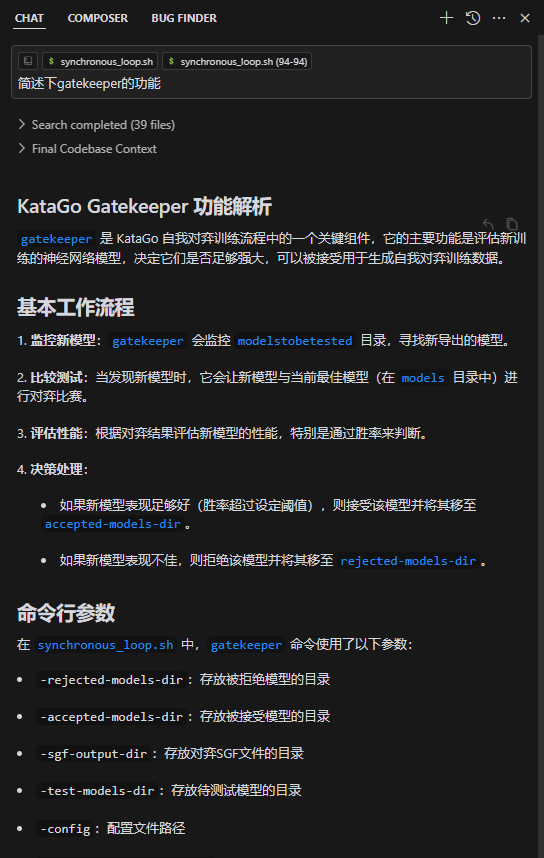
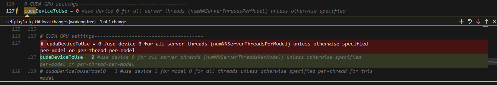
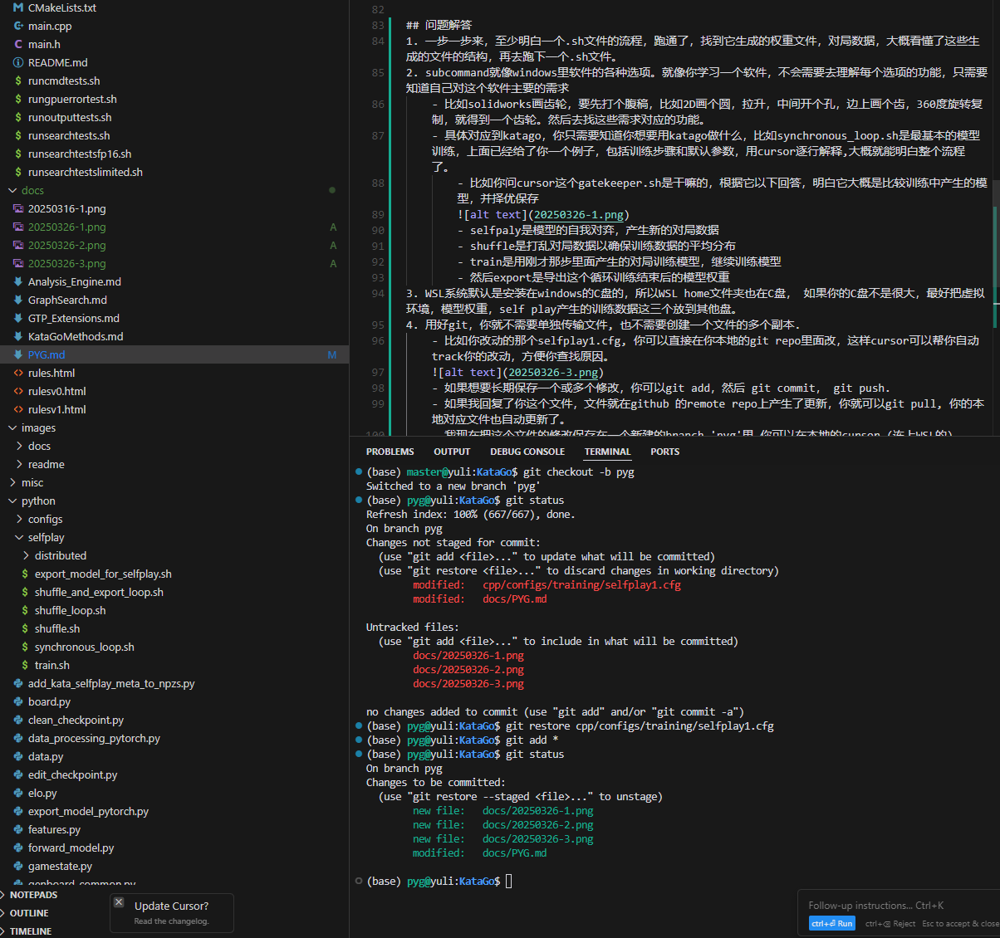
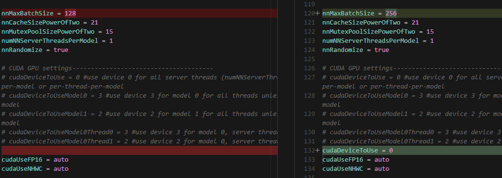

# 2025-03-16

## 进展:
1.	阅读KATAGO源码几个文件夹内的md文档
2.	CPP环境搭建，使用visual studio提供的环境，试跑其中CPP文件的Cmakelist，根据说明文档和报错内容安装了vcpkg和zlib，设置NO_GIT_REVISION ON后主函数可运行，warn报错zlib相关问题影响selfplay，获得了可以运行的katago.exe文件，最后VS调试台显示如下，目前不确定是否正常：

3.	试运行sh脚本，理解中脚本是按顺序执行对应的文件，从而完成相应的功能模块，安装GIT FOR WINDOWS，试运行部分脚本，可以运行只是大部分sh脚本前置输入可能不足导致无法正常输出。
4.	安装pycharm，pytorch试运行python文件夹的内容，同样是对每一步的输入输出还没弄清楚。
5.	读了下KATAGO原本的论文，不过大部分是在讲网络本身的架构，分层这些，之后还需要仔细看。

## 主要问题：
1.	有点不太清楚下一步编译应该干嘛，现在是打算用GUI和线程的network先看看运行起来是什么样子的，正常运行是个什么状态，再了解自己从源码出发应该干嘛。
2.	有点没太整明白cpp和python协同的项目环境，现在CPP应该是在VS集成好的环境里面，pycharm的话应该也有自己的环境，不太确定这两个东西是否相互需要关联或者各自能跑通就行了。
3.	Cpp的子文件确实有点多，比起python那边感觉更不好理解（比如python文档很清楚的讲了selfplay大致分哪五步），现阶段是打算一个一个看下每个子模块究竟在干嘛，再看sh文件在怎么调动模块完成哪些功能，最后再从上到下看整体是怎么循环调用功能模块运行起来的。


## 工作建议
-	不要再用windows, 你在自己的Windows里面可以安装WSL的ubuntu, 以后程序和文件都在ubuntu里面跑. Linux才能让你接触电脑最底层的东西，也最终能让你有效率地工作。
-	不要用pycharm和visual studio。直接用Cursor IDE, 兼容所有语言，也包含了代码助手。 
-	安装了WSL之后，cursor左下角按钮，有直接连接WSL, 在WSL里面，可以在/mnt 里面找到你的windows里的其他硬盘，比如D:// 就是 /mnt/d/. 你可以在/mnt/d/里面创建一个文件夹，用来储存你的所有本地代码，比如 /mnt/d/source/katago
-	按照https://github.com/lightvector/KataGo/blob/master/Compiling.md 里面的linux部分内容compile, 然后得到katago 的应用程序。主要步骤包含:
    - 安装显卡驱动, 如果没记错的话，Windows的显卡驱动跟WSL的显卡驱动是分开的，所以需要单独在WSL里安装。
        ```bash
        sudo apt-get update
        sudo apt-get install -y nvidia-driver-<找你的显卡对应的驱动版本>
        ```
    - 安装conda
        ```bash
        wget https://repo.anaconda.com/miniconda/Miniconda3-latest-Linux-x86_64.sh
        ```
    - 在conda里面创建一个虚拟环境,
        ```bash
        conda create -n katago python=3.8
        ```
    - 进入这个环境以后, 才根据自己的显卡和显卡驱动的版本，安装对应的cuda, cudnn, TensorRT, 然后按照里面的TensorRT 版本来compile Katago. 你现在得到的是一个可以运行的Katago 程序。
        ```bash
        conda activate katago
        ```
    - 安装CUDA Toolkit (https://developer.nvidia.com/cuda-toolkit),TensorRT (https://developer.nvidia.com/tensorrt) that is at least version 8.5.
        ```bash
        conda install pytorch torchvision torchaudio cudatoolkit=11.3 -c pytorch
        ```
    - 下载cmake，检查最少是 version of 3.18.2

        ```bash
        sudo apt install cmake
        ```
    - 用git 下载katago源码
        ```bash
        cd <你想要存放所有源码的文件夹， 比如 "/mnt/d/source">
        git clone https://github.com/lightvector/KataGo.git
        ```
    - Compile Katago
        ```bash
        # 进入cpp文件夹
        cd KataGo/cpp
        cmake . -DUSE_BACKEND=TENSORRT
        make -j 4
        ```
    - 下载一个最新的最强大的网络权重 [the main training website](https://katagotraining.org/).
    - 读一下设置，看下有不有需要修改的，比如比赛规则，贴目之类的 `configs/gtp_example.cfg` (see "Tuning for Performance" above).
    - 然后就可以用各种.sh文件来调用katago了
 
## 问题解答
-   各个.sh文件就是给你样例，让你知道katago可以怎么用命令行来调用,比如 
    - cpp/**.sh 主要是怎么使用编译完的程序，比如计算胜率，局面分析，搜索最佳落子点，等等
    - python/selfplay/**.sh 主要是怎么用训练好的模型进行selfplay产生新的对局数据，然后怎么用新的对局数据来继续训练模型
    - 你用cursor帮你逐个解释每个.sh文件里的每行命令是用来干嘛的。然后把注释加上去，然后去理解下每个参数是啥，尝试运行下，多运行几次你就大概学会bash script了

# 2025-03-23

## 进展:
1. 安装WSL系统并在其中配置项目环境，通过编译，下载权重后，可以正常运行；测试和理解katago程序的subcommand；
2. 安装python试运行脚本，尝试跑synchronous_loop.sh，其中synchronous_loop.sh输入参数可能没选对，可以运行但没跑完。
这周出差使用一个3060的笔记本，网速有限，下不了太多东西，所以编译的后端采用CUDA，虚拟环境直接用了python3 env在项目目录里面创建。python3这个虚拟环境我还是有很多没搞明白的地方，后续在台式机上打算用conda先创建环境。
3.大致阅读了subcommand的主要脚本，python部分的脚本和config文档，对selfplay的流程有了大致的了解，但细节还有不清楚的地方，下周需要接着看。

## 主要问题
1. 需要明确下一步的目标，是否还有重要得内容待完成；目前暂且是打算用modelconfig里面的小模型参数再试一下跑synchronous_loop.sh，并且尝试把脚本里面的一些训练参数进行修改。
2. cpp里面主程序的subcommand其实只理解了一个大概，主要就是命令的功能需要的输入和输出，离了解每个文件怎么来的还差距很远，不确定了解到什么程度，看起来有点没方向，需要明确是否搞错了目标。
3. 我把源码直接git clone到了 home文件里面的虚拟系统下面的文件夹里面，这样我activate python的虚拟环境比较方便，目前还不清楚这样做是否有问题，还是没放在mnt下面只影响东西存在硬盘里面的哪个位置。

## 问题解答
1. 一步一步来，至少明白一个.sh文件的流程，跑通了，找到它生成的权重文件，对局数据，大概看懂了这些生成的文件的结构，再去跑下一个.sh文件。
2. subcommand就像windows里软件的各种选项。就像你学习一个软件，不会需要去理解每个选项的功能，只需要知道自己对这个软件主要的需求
    - 比如solidworks画齿轮，要先打个腹稿，比如2D画个圆，拉升，中间开个孔，边上画个齿，360度旋转复制，就得到一个齿轮。然后去找这些需求对应的功能。
    - 具体对应到katago，你只需要知道你想要用katago做什么，比如synchronous_loop.sh是最基本的模型训练，上面已经给了你一个例子，包括训练步骤和默认参数，用cursor逐行解释,大概就能明白整个流程了。
        - 比如你问cursor这个gatekeeper.sh是干嘛的，根据它以下回答，明白它大概是比较训练中产生的模型，并择优保存
        
        - selfpaly是模型的自我对弈，产生新的对局数据
        - shuffle是打乱对局数据以确保训练数据的平均分布
        - train是用刚才那步里面产生的对局训练模型，继续训练模型
        - 然后export是导出这个循环训练结束后的模型权重
3. WSL系统默认是安装在windows的C盘的，所以WSL home文件夹也在C盘， 如果你的C盘不是很大，最好把虚拟环境，模型权重，self play产生的训练数据这三个放到其他盘。
4. 用好git，你就不需要单独传输文件, 也不需要创建一个文件的多个副本.
    - 比如你改动的那个selfplay1.cfg, 你可以直接在你本地的git repo里面改，这样cursor可以帮你自动track你的改动，方便你查找原因。
    
    - 如果想要长期保存一个或多个修改，你可以git add，然后 git commit， git push. 
    - 如果我回复了你这个文件，文件就在github 的remote repo上产生了更新，你就可以git pull, 你的本地对应文件也自动更新了。
    - 我现在把这个文件的修改保存在一个新建的branch 'pyg'里,你可以在本地的cursor (连上WSL的) terminal 里 git switch pyg, 然后git pull, 你的本地文件就自动更新了。
    - 你每周有新的进展和问题，也在本地这个文档里改，之后git add, git commit, gitpush, 我就可以看到你的更新了。我已经把你加成这个repo的collaborator,你就不用每次都开一个pull request了。记得你在此之前要设置一下github的ssh key(大概就是在本地创建一个ed25519 key pair,然后在github的settings里面创建一个对应这台本地电脑WSL的ssh access, 然后把这个public key复制粘贴到ssh access里面), 详细步骤问cursor.
    

5. 你也大致学习下cursor/VScode的功能，比如比较两个相似文件。 
    
6. 正如上图里你发的那个selfplay1test.cfg, 你改了cudaDeviceToUse=0，应该就是告诉系统你没有显卡，所以不会用GPU来训练。如果你想确认，可以直接问cursor chat （右下角的codebase可以查找整个repo）, 让它帮你找到这个参数定义。

